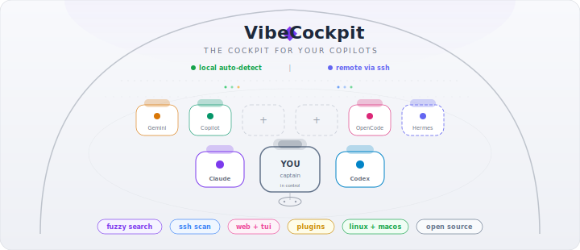

<p align="center">
  
</p>

<h1 align="center">VibeCockpit</h1>

<p align="center">
  <strong>The cockpit for your copilots.</strong><br>
  Browse, search, and resume AI coding sessions across all your tools — from one dashboard.
</p>

<p align="center">
  <a href="https://github.com/NJannasch/vibecockpit/releases"></a>
  
  
  
  <a href="LICENSE"></a>
  <a href="https://vibecockpit.dev"></a>
</p>

---

## Why?

You vibe-code across multiple AI tools. Claude Code, Claude Desktop, Codex, Copilot, Gemini, OpenCode, Cursor, Antigravity — each stores sessions in its own format and directory. Switching between them means losing track of where you left off.

**VibeCockpit** scans all of them automatically and gives you one place to search, filter, and resume any session — locally or on remote machines via SSH.

## Quick Start

```bash
# Install (Linux / macOS)
curl -fsSL https://raw.githubusercontent.com/NJannasch/vibecockpit/main/install.sh | bash

# Launch the web dashboard
vibecockpit --web

# Or use the terminal TUI
vibecockpit
```

That's it. VibeCockpit auto-detects which tools you have installed and shows all your sessions.

## Supported Tools

| Tool | Auto-detect | Resume | Remote SSH |
|------|:-----------:|:------:|:----------:|
| [Claude Code](https://docs.anthropic.com/en/docs/claude-code) | ✅ | ✅ | ✅ |
| [Claude Desktop](https://claude.ai/download) (Claude Code in the desktop app) | ✅ (macOS) | ✅ | — |
| [Codex CLI](https://github.com/openai/codex) | ✅ | ✅ | ✅ |
| [GitHub Copilot CLI](https://docs.github.com/en/copilot/github-copilot-cli) | ✅ | ✅ | ✅ |
| [OpenCode](https://opencode.ai) | ✅ | — | ✅ |
| [Gemini CLI](https://github.com/google-gemini/gemini-cli) | ✅ | — | ✅ |
| [Cursor Agent](https://www.cursor.com/) (CLI + IDE) | ✅ | ✅ | — |
| [Antigravity](https://idx.google.com/) (Google) | ✅ | ✅ | — |
| Custom agents (Hermes, etc.) | via SSH | — | ✅ |

> **Zero config required.** If the tool's data directory exists (`~/.claude`, `~/.codex`, etc.), VibeCockpit finds it.

## Features

- **Dashboard** — overview of all tools with session counts, active indicators, and recent activity
- **Cost tracking** — see what your AI coding tools cost you across all providers. Heatmap, trend charts, per-project breakdown, and plan recommendations that tell you which subscription tier actually fits your usage
- **Fuzzy search** — type `hermes` or `model:opus branch:main active` to find anything
- **Filter chips** — click to filter by tool, model, or active status
- **Group by** tool, project, or date — collapsible sections
- **File tree view** — see all projects as a filesystem tree, tool-agnostic
- **Model picker** — resume with a different model (including 1M context variants)
- **Remote SSH scanning** — scan sessions on remote machines, resume via SSH terminal
- **Dark / light theme** — persisted to config
- **Plugin architecture** — extensible for custom tools and agents
- **Terminal TUI** — keyboard-driven alternative with the same search and filtering

## Install

### One-line install (Linux / macOS)

```bash
curl -fsSL https://raw.githubusercontent.com/NJannasch/vibecockpit/main/install.sh | bash
```

To **update**, run the same command — the installer detects your existing version and upgrades in place.

> **macOS note:** If you download a binary manually (not via the install script), macOS may show a Gatekeeper warning. Fix with: `xattr -d com.apple.quarantine ~/.local/bin/vibecockpit`  
> The install script handles this automatically.

<details>
<summary>More install options</summary>

```bash
# With wget
wget -qO- https://raw.githubusercontent.com/NJannasch/vibecockpit/main/install.sh | bash

# Specific version
VERSION=v0.1.0 curl -fsSL https://raw.githubusercontent.com/NJannasch/vibecockpit/main/install.sh | bash

# Custom directory
PREFIX=/opt curl -fsSL https://raw.githubusercontent.com/NJannasch/vibecockpit/main/install.sh | bash

# From source (Docker — recommended; produces a host-platform binary)
git clone https://github.com/NJannasch/vibecockpit && cd vibecockpit
./build.sh                   # Docker handles Node + Go inside the container

# Or build with your own toolchain (Node 22+ and Go 1.24+ required)
./build.sh local

# Download binary directly
# → https://github.com/NJannasch/vibecockpit/releases
```

</details>

### Start on login (optional)

```bash
vibecockpit --autostart       # systemd (Linux) or launchd (macOS)
vibecockpit --remove-autostart
```

## Configuration

Config is at `~/.config/vibecockpit/config.yaml`. Most settings can also be changed from the web UI settings page.

```yaml
terminal: default                 # auto-detected, or: kitty, alacritty, wezterm, ghostty, ...
theme: light                      # light | dark
sort_by: modified                 # modified | created | name | messages
group_by: none                    # none | provider | project | date

# Override binary paths (e.g. tools installed via nvm)
provider_paths:
  gemini: ~/.nvm/versions/node/v22.21.1/bin/gemini
  opencode: ~/.nvm/versions/node/v22.21.1/bin/opencode

# Scan remote machines via SSH
remote_sources:
  - name: my-server
    host: dev.example.com
    user: deploy
    method: ssh     # or http (for remote VibeCockpit instances)
```

> **Tip:** When a tool can't be found in PATH, VibeCockpit shows the exact config to add — including an "Open Settings" button in the web UI.

## TUI Keyboard Shortcuts

| Key | Action |
|-----|--------|
| `↑` `↓` `j` `k` | Navigate |
| `Enter` | Resume session |
| `m` | Pick model, then resume |
| `/` | Fuzzy search + filters |
| `s` | Cycle sort |
| `Tab` | Cycle grouping |
| `n` | New project |
| `d` | Delete session |
| `q` | Quit |

## How It Works

VibeCockpit reads session data directly from each tool's local storage. It **never modifies** your session files (except when you explicitly delete a session).

| Tool | Data Location |
|------|---------------|
| Claude Code | `~/.claude/projects/*/sessions-index.json` + `*.jsonl` |
| Claude Desktop | `~/Library/Application Support/Claude/claude-code-sessions/*/*/local_*.json` (macOS) |
| Codex CLI | `~/.codex/state_5.sqlite` + `history.jsonl` |
| Copilot CLI | `~/.copilot/session-state/*/workspace.yaml` + `events.jsonl` |
| OpenCode | `~/.local/share/opencode/opencode.db` |
| Gemini CLI | `~/.gemini/tmp/*/chats/*.json` |
| Cursor Agent (CLI) | `~/.cursor/chats/<hash>/<uuid>/store.db` |
| Cursor Agent (IDE) | `~/.config/Cursor/User/globalStorage/state.vscdb` |
| Antigravity | `~/.gemini/antigravity/brain/*/task.md.metadata.json` |

> Resuming a Claude Desktop session uses the `claude://resume?session=…` deep link, opening the conversation back in the Claude Desktop app. Sessions deduped across the standalone CLI and the desktop wrapper so each appears once.

For remote machines, it runs scan commands over SSH — no agent installation required on the remote.

## Cost Tracking

VibeCockpit extracts token usage from your session files and estimates costs using current API pricing. No API keys or billing access needed — it's all computed locally from the data already on your machine.

**What you get:**
- Per-session cost estimates on every session card (`$12.40` or `~$3.50` for estimates)
- GitHub-style activity heatmap — switch between cost, tokens, messages, or session count
- Stacked trend chart — daily, weekly, or monthly, grouped by tool or project
- **Plan recommendations** — compares your actual usage against Claude Max 5x/20x, ChatGPT Pro, Gemini Ultra, and tells you which tier fits. Includes estimated API-equivalent value per plan so you can right-size.
- Model mix analysis — flags if you're spending 90% on Opus when Sonnet would work for routine tasks
- Week-over-week trends, top projects by cost, unused tool alerts

**Supported token sources:**

| Provider | Token data | Cost accuracy |
|----------|-----------|---------------|
| Claude Code | Input, output, cache read/write per message | Exact |
| OpenCode | Input, output, reasoning, cache per message | Exact |
| Gemini CLI | Input, output, cached, thoughts per message | Exact |
| Codex CLI | Total tokens per session | Estimated (70/30 split) |
| Copilot CLI | No token data (flat subscription) | N/A |
| Cursor Agent (CLI) | Estimated from message blob sizes | Estimated |
| Cursor Agent (IDE) | Estimated from message count | Estimated |
| Antigravity | Conversations encrypted, no token data | N/A |
| Remote (SSH) | Not yet supported | — |

## Contributing

VibeCockpit is built with **Go** (backend + TUI) and **Svelte 5** (web UI).

```bash
git clone https://github.com/NJannasch/vibecockpit
cd vibecockpit

# Development: start Go API and Svelte dev server separately
vibecockpit --web --port 3456 &   # API backend
cd frontend && npm run dev         # Svelte with hot-reload (proxies API)

# Full build (Docker — recommended)
./build.sh                         # cross-builds inside Docker
./build.sh local                   # if you'd rather use the host toolchain

# Run tests
go test ./...
```

### Adding a new provider

1. Create `internal/provider/yourprovider/yourprovider.go`
2. Implement the [`provider.Provider`](internal/provider/provider.go) interface
3. Add an `Available() bool` check
4. Register in [`main.go`](main.go) → `buildRegistry()`

### Architecture

```
frontend/             Svelte 5 + Vite (web UI)
internal/
  plugin/             Plugin system + registry
    remote/           SSH + HTTP remote scanning
  provider/           Session scanning per tool
    claude/           Claude Code (JSONL)
    claudedesktop/    Claude Desktop's bundled Claude Code (macOS, deep link)
    codex/            Codex CLI (SQLite)
    copilot/          Copilot CLI (YAML + events)
    opencode/         OpenCode (SQLite)
    gemini/           Gemini CLI (JSON)
  search/             Fuzzy matching + filter parsing
  tui/                Terminal UI (bubbletea)
  web/                HTTP server, embeds Svelte build
  config/             YAML config management
  launcher/           Terminal-aware process launching
  install/            Binary install, desktop entry, autostart
```

## CLI Reference

```
vibecockpit [flags]

  --web                Start the web UI (opens in browser)
  --port int           Port for the web UI (default: 3456)
  --list               List all sessions (table format)
  --list --json        List all sessions (JSON format)
  --version            Print version
  --install            Install to ~/.local/bin (+ Linux .desktop or macOS .app)
  --uninstall          Remove the installed binary, app launcher, and autostart
  --autostart          Start on login (systemd/launchd)
  --remove-autostart   Remove autostart service
  --yes                Skip confirmation prompts
```

## License

[MIT](LICENSE) — Nils Jannasch
